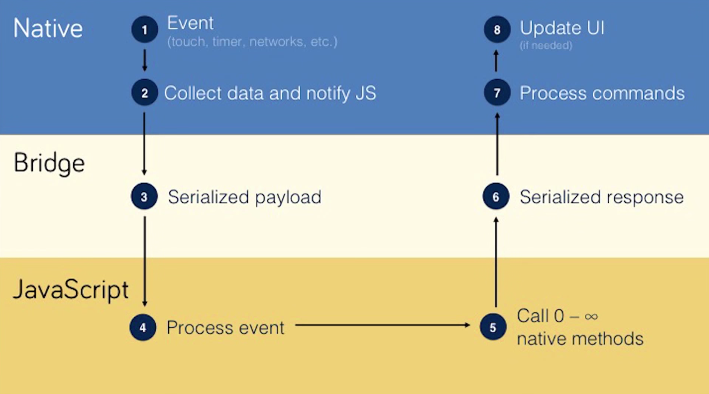

---

### Biography of a React Native App
<span style="color:gray">The Story of GroupThreads Dash</span>

Note:
influenctial time

---

#### This is a Story

React Native and Leading Tech Decisions

Developing Core Principles

---

#### Context

Coffeeshop Meeting with Keagan, Co-Founder GroupThreads

GroupThreads' Distruptive Model

High-Growth -> Need for Better Technology

Note:
Keagan was CMO

---

#### Mobile App

Desktop Angular 1.0 Web App

Providing a Mobile Experience

Investors

Note:
- There is nothing wrong with a working app, as long as it's usable
- 

---

#### Whiteboard Night

CEO Shares Vision

Mockups with Balsamiq & Google Drive

---


---


---


---


---


---


---

#### Lesson 0

*Designs serve as a rich form of communication, and a meeting point between technical and non-techinal people*

---

#### The React Native Decision

Experience with Golang on Mobile

Surveying Future Users

---

#### Lesson 1

*Don’t decide on using a cross-platform mobile technology until you know who is going to be using the app*

---

#### What Distinguishes React Native

Know FE Web? React? Great.

Open Source, Big Community

The Real Deal: A Native Experience

Code Push

Better Than Golang on Mobile

---

#### Achieving a Native Experience

Your Phone is Running React with JavaScript Core

JavaScript is Doing the Business Logic

React Problem: Need to Sync Virtual DOM to UIKit, Asynchronously

---

#### The Bridge: JavaScript Communicating with Native

Events Registered in Native Code (touches, network calls, etc.)

Asynchronous API (to Native), Batched Messages, Exchange Serializable Messages

Native -(JSON)-> JavaScript -(JSON)-> Native -> Execute Commands & Update UI

---



---

#### How Components Work

JS Wrappers: Take Method and Module Name, Arguments, and Add it To Message Queue

Native Builds This Module

e.g. `<View>` in RN Maps to: UIView (iOS), <div> (Chrome), android.view (Android)

---

#### Starting with a Boiler Plate

Choosing a Boiler Plate

Minimal Templates

---

#### Up And Running


---

#### Ignite

Reusable Components

Redux: Sagas, Reducers, Actions

Note:
Ask how much they know about this pattern

---

#### Actions

```javascript
// The function that is called when the login button is 
// pressed
handlePressLogin = () => {
    const { username, password } = this.state
    this.isAttempting = true

    // attempt a login - a saga is listening to pick it 
    // up from here
    // attemptLogin prop is mapped to a dispatch in 
    // mapDispatchToProps
    this.props.attemptLogin(username, password)
    }

    ...

    // This maps the attemptLogin prop to the 
    // attemptLogin Action
    const mapDispatchToProps = (dispatch) => {
        return {
            logout: NavigationActions.logout,
            attemptLogin: (username, password) => 
            dispatch(Actions.attemptLogin(username, password))
        }
    }
}
```

---

#### Saga

```javascript
// Generator in the LoginSaga
// Waits for the Login button press
export function * watchLoginAttempt () {
    // daemonize
    while (true) {
      // wait for LOGIN_ATTEMPT actions to arrive
      const { username, password } = 
                    yield take(Types.LOGIN_ATTEMPT)
      // call attemptLogin to perform the actual work
      yield call(attemptLogin, username, password)
    }
  }
```
---

#### Business Logic

```javascript
// Code that watchLoginAttempt generator calls upon activation
// attempts to login
export function * attemptLogin (username, password) {
    var loginSuccess = false
  
    yield fetch('http://localhost:1337' + '/admin/login/', {
      method: 'POST',
      headers: {
        'Accept': 'application/json'
      },
      body: JSON.stringify({
        email: username,
        password: password
      }),
      credentials: 'include'
    }).then((response) => {
```

---

#### Search

Defining Search

Elasticsearch, Algolia, Apache Solr

RESTful and Free

Note:
filtering, search, what do you want?

---

#### Reflecting a MongoDB in Elasticsearch

Mongo Connector

Microservice Architecture Using Docker and Rancher

Getting Containers to Play Nice

Note:
Mongo Connector does initial sync and tails MongoDB tx log

When a container goes down, we bring both down and hard reset

Must make the containers a mutually reliable pair

---

#### Fastlane: Automating a Pipeline

Build/Test/Release, Rinse, Repeat

A Boring, Reliable, Standardized Process Feels Good

Note:
Describe TestFlight process (automated, communication)

---

#### Lesson 2:

*Create a “pull” process in getting feedback, whenever possible*

Note:
saves time

---

### Retrospective

##### The Good

* Mockups
* React/React Native
* Fastlane
* Rancher

Note:
React Native was a good choice for:
- Time and team friendliness - other developer could help

---

### Retrospective

##### Points for Improvement

* Testing
* Start at the Router
* Git-like Tracking is the Standard; Track Everything


---

#### Links

* [GroupThreads Dash on the App Store](https://itunes.apple.com/us/app/groupthreads-dash/id1162856658?mt=8)


---