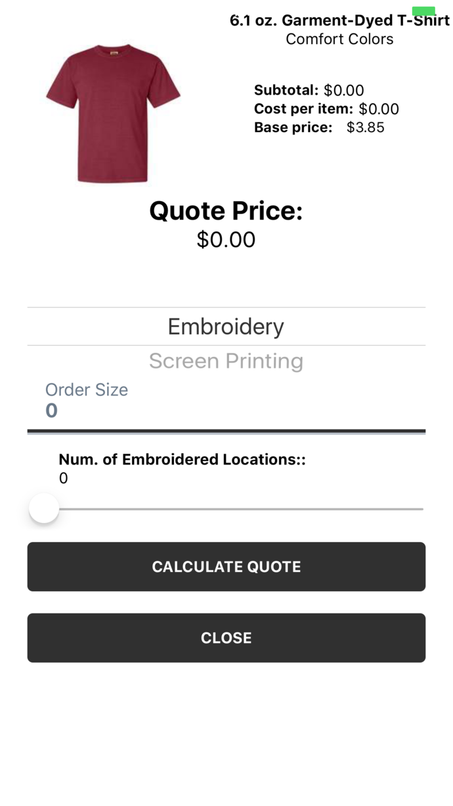

---

### Biography of a React-Native App
<span style="color:gray">The story of GroupThreads Mobile Dash</span>

Note:
influenctial time

---

#### This is a Story

React Native and Leading Tech Decisions

Developing Core Principles

---

#### Context

Coffeeshop Meeting with Keagan, Co-Founder GroupThreads

GroupThreads' Distruptive Model

High-Growth -> Need for Better Technology

Note:
Keagan was CMO

---

#### Mobile App

Desktop Angular 1.0 Web App

Providing a Mobile Experience

Investors

Note:
- There is nothing wrong with a working app, as long as it's usable
- 

---

### Whiteboard Night

CEO Shares Vision

Mockups

---


---


---


---



---


---


---

#### The React Native Decision

Experience with Golang on Mobile

Surveying Future Users

Enthusiasm About Cross-Platform Mobile Tech

---

#### What Distinguishes React Native

Know FE Web? React? Great.

"Learn Once, Write Anywhere"

---

```javascript
    render() {
        /* Navigate to the search result page, passing searchText and searchResults as props */
        const goToSearchResults = () => Actions.searchView({ searchText: this.state.searchText,
          searchResults: this.state.searchResults });
    
        if (!this.state.loaded) {
          return this.renderLoadingView();
        }
    
        return React.createElement(
          View,
          { style: Styles.modalContainer },
          React.createElement(
            View,
            { style: { borderColor: '#303030' } },
            React.createElement(Sae, {
              label: 'Search for a Product',
              height: 38,
              onChangeText: text => this.setState({ searchText: text }),
              iconClass: FontAwesomeIcon,
              iconName: 'search',
              iconColor: 'white',
```

```jsx
   render() {
    /* Navigate to the search result page, passing searchText and searchResults as props */
    const goToSearchResults = () => Actions.searchView({ searchText: this.state.searchText,
							 searchResults: this.state.searchResults })

    if (!this.state.loaded) {
      return this.renderLoadingView()
    }

    return (
      <View style={Styles.modalContainer}>
        <View style={{borderColor: '#303030'}}>
          <Sae
            label={'Search for a Product'}
            height={38}
            onChangeText={(text) => this.setState({searchText: text})}
            iconClass={FontAwesomeIcon}
            iconName={'search'}
            iconColor={'white'}
```


---

#### Starting with a Boiler Plate

Choosing a Boiler Plate

React Native Bloat

Minimal Templating

---

#### Ignite

Redux: Sagas, Reducers, Actions

Note:
Ask how much they know about this pattern

---

#### Saga


---

#### Links

* [GroupThreads Dash on the App Store](https://itunes.apple.com/us/app/groupthreads-dash/id1162856658?mt=8)


---